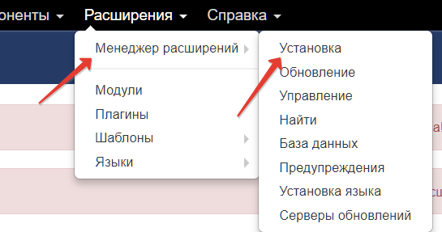
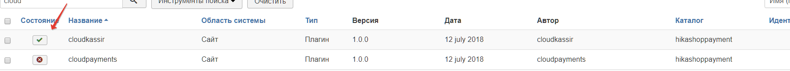
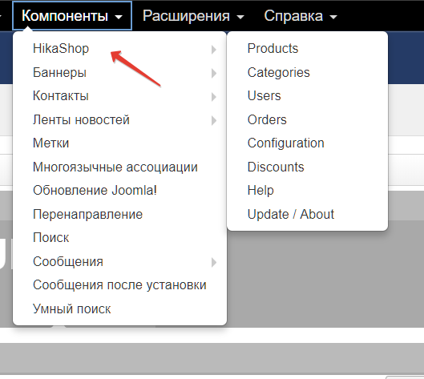
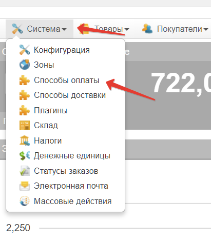
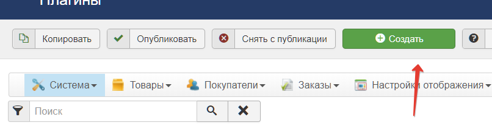
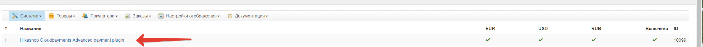
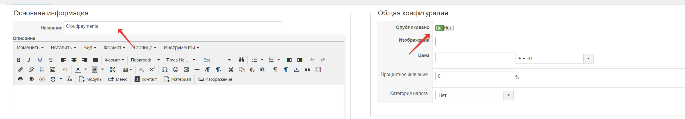
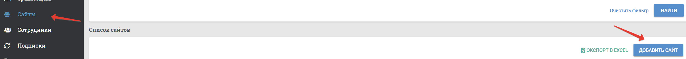
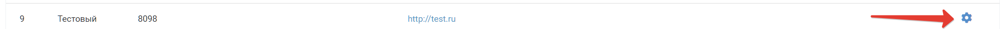
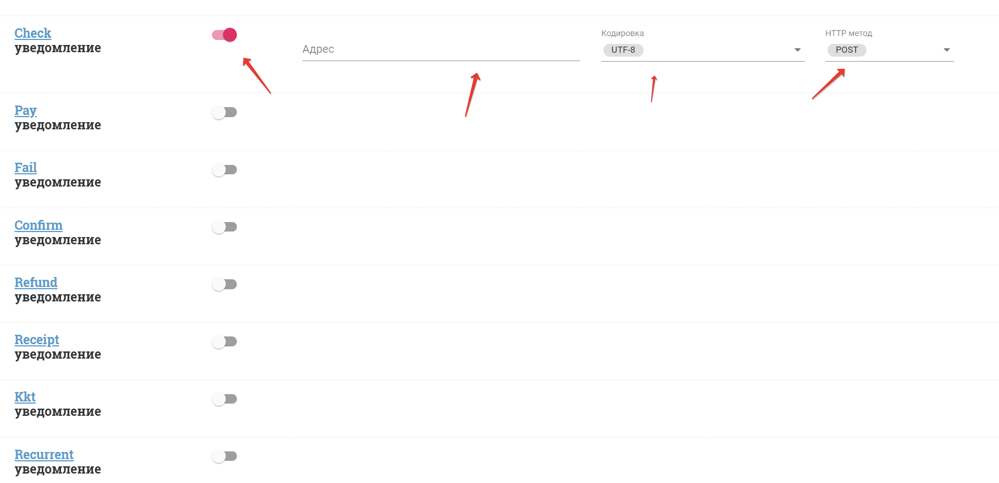

# CloudPayments модуль для Joomla - Hikashop
Модуль позволит с легкостью добавить на ваш сайт оплату банковскими картами через платежный сервис CloudPayments. 
Для корректной работы модуля необходима регистрация в сервисе.

Порядок регистрации описан в [документации CloudPayments](https://cloudpayments.ru/Docs/Connect)

### Совместимость:
- Hikashop >= 3.4.0
- Joomla >= 3.8.2

Модуль тестировался на Hikashop = 3.4.0 (Joomla = 3.8.2)

### Возможности:
- Одностадийная схема оплаты;
- Двухстадийная схема оплаты;
- Поддержка онлайн-касс (ФЗ-54);
- Отправка чеков по email;
- Отправка чеков по SMS;

### Установка через панель управления
В панели адмниистратора зайти в раздел "Расширения/Менеджер расширений/Установка"

После чего загрузите zip архив
 Зайдите в управление плагинами. Убедитесь, что плагин включен.

### Настройка плагина
- Перейдите в настройки Hikashop  

- Далее необходимо выбрать способы оплаты   

- Нажать кнопку "Создать"  

- Выбрать  платежный плагин  

- В качестве имени новой платежной системы указать: "CloudPayments" - **это обязательный пункт!!!**  

- Также выбрать "Опубликовать" - "да"
- Далее ввести "Public ID" - из личного кабинета мерчанта CloudPaymentsloudpayments и пароль API, указываем нужные статусы для реагирования плагина на изменения заказа. Для двухстадийки также надо добавить новый статус "авторизации".

После настройки плагина - сохраните изменения и перейдите к настройки вебхуков в ЛК мерчанта Cloudpayments
Все подсказки по настройки есть в шапке плагина. 

### Настройка вебхуков
Перейдите в ЛК мерчанта cloudpayments. Сайты -> Добавить сайт

Далее в списке сайтов выбрать  сайт и зайти в настройки

Далее активируйте нужный пункт и добавьте адрес вебхука

Список нужных вебхуков:

Настройки Сheck уведомлений: http://ваш_домен/bitrix/tools/sale_ps_result.php?action=check  
Настройки Pay уведомлений: http://ваш_домен/bitrix/tools/sale_ps_result.php?action=pay  
Настройки Fail уведомлений: http://ваш_домен/bitrix/tools/sale_ps_result.php?action=fail  
Настройки Void уведомлений: http://ваш_домен/bitrix/tools/sale_ps_result.php?action=void  
Настройки Confirm уведомлений: http:/ваш_домен/bitrix/tools/sale_ps_result.php?action=confirm  
Настройки Refund уведомлений: http://ваш_домен/bitrix/tools/sale_ps_result.php?action=refund  
где **ваш_домен** нужно заменить на домен вашего сайта.  

#### Changelog

= 1.1 = 
* Добавление выбора дизайна виджета;  
* Правка значений ставок НДС;

= 1.0 =
* Публикация модуля.